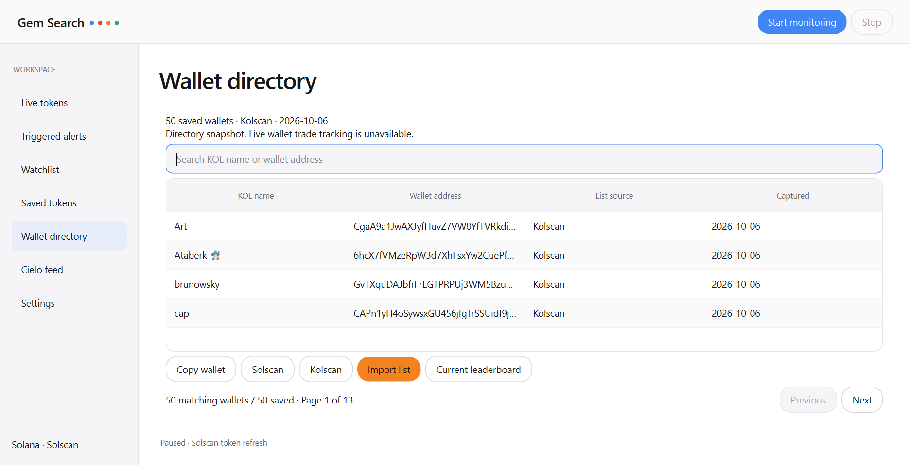

# Solscan desktop workflow

The desktop uses a white workspace with orange, blue, red, green and black accents: a compact header, left navigation, large section headings and one primary content area. Monitoring duration, Keep on top and minimize preferences are in Settings. The former dashboard cards and horizontal tab strip are removed. Wallet tracking and inflow alert coverage are described below.

All active desktop discovery, token metadata, USD prices and market capitalization come from Solscan. There is no DexScreener or GeckoTerminal fallback in the desktop app. The server crawler has separate legacy provider integrations.

Open Settings and enter your Solscan Pro API key locally, then select Save Solscan connection. Windows encrypts the saved credential for your Windows account using DPAPI. The key is kept outside the repository in the app data directory. SOLSCAN_API_KEY is also supported. API endpoint access depends on your Solscan account plan. No key is included with the download.

Start monitoring manually, choose Until I stop or a time limit, and stop from the window or tray. Closing the window keeps the app in the tray. Quit stops the app. Your computer must remain awake for monitoring.

Solscan covers Solana. Latest-token discovery samples 20 tokens per minute. Watched tokens refresh first and saved tokens rotate in batches. There is no claim of complete chain coverage. Existing token history is preserved locally, but legacy provider rows are hidden from Live tokens and Watchlist until refreshed from Solscan. Alert history remains visible. Saved tokens exposes historical records with their original provider and sample time. When no Solscan credential is configured, Live tokens shows a connection prompt and Start monitoring opens Settings.

Direct Solana RPC reads independently confirm mint identity, decimals and supply at confirmed commitment. This is the verification layer, not an alternative price source. Mint verification cannot independently prove Solscan USD prices or circulating market capitalization. Verification status and confirmed slots are available in token details. Samples older than three minutes are stale.

The early market-cap rule uses Solscan market capitalization and Solscan token creation time, gated by mint verification. Token creation time is provider reported, not independently verified. Net inflow notifications are pending validation of Solscan swap direction and historical USD amounts. The app does not substitute volume, current-price estimates or legacy-provider values for five-minute net inflow. This preview needs a connected Solscan account to validate live swap coverage before those alerts can be enabled.

The dark desktop has Google blue, red, yellow and green accents, fitted table pages, search, watchlists, local alerts and notifications. Windows notification delivery depends on system settings. The executable is an unsigned Windows x64 preview bundling Python and Qt. Download the ZIP for licenses.

Build from source using requirements-desktop.txt and scripts/build_desktop.py. Run desktop.py --smoke-test PATH or --responsiveness-test PATH with a fresh --data-dir to test the local desktop workflow without network requests.

Free API credentials are supported through Solscan documented playground/token/meta. When Pro discovery access is rejected, the app refreshes saved and watched Solana tokens through this free endpoint. It does not invent free discovery coverage. Add token addresses in Settings. Other providers remain excluded.

The documented free metadata route has stricter observed request limits than the plan card suggests. Free mode conservatively refreshes one token per minute, rotating through the watchlist when present or saved Solana tokens otherwise. Successful responses survive later failures. Rate-limited tokens retry next minute. Samples can become stale; there is no claim of continuous full-market coverage.

Minimize when I click outside is enabled by default. Focus loss minimizes the window without stopping its workers. Active dialogs and pop-up menus do not trigger minimization. Keep on top defaults off and remains optional.

### KOL wallets

The KOL wallets tab contains 50 Solana wallet names and addresses observed on Kolscan's daily leaderboard on October 6, 2026. Search names or addresses, copy a selected wallet, or open its Solscan or Kolscan account page. Pages fit the window without nested scrolling.

This is a dated directory snapshot, not the complete registered KOL population. Kolscan supplies these names; they are not individually verified Solscan labels. Wallet trade monitoring and KOL trade notifications are not enabled in this release. Token prices and market caps continue to come from Solscan.

Import additional CSV or JSON lists using `name` and `address` fields. CSV requires a header row. JSON requires an array of objects. Imports validate Solana address encoding, merge by wallet address and persist locally in `kol-wallets.json`. The app accepts up to 10,000 imported wallets and files smaller than 2 MB. Bundled Kolscan names take precedence for matching addresses. Imports do not add wallet addresses to the token watchlist.

Source: https://kolscan.io/leaderboard

### Cielo connection

Sign in at https://build.cielo.finance yourself. The official API key guide points to General settings, API Key Manager and Generate New Key. Enter the key in Settings, Save Cielo connection. The Solscan field manages the existing token-data credential separately. Both keys use Windows DPAPI, outside the repository, and are never bundled with the release. Environment variables CIELO_API_KEY and SOLSCAN_API_KEY are supported for local backend use.

Cielo feed supports an explicit request for the account's Solana feed or a selected directory wallet through the documented GET /api/v1/feed endpoint. Requests run in a background thread and use account API credits. This initial connection screen displays the returned response without assuming unvalidated trade field names. No automated trade alerts are enabled before response validation. Failed requests retain the last received response.

The developer documentation lists the free API tier as feed-only. User list retrieval is documented for Builder, Architect and Enterprise plans. A free Cielo web account and a free API key have different capabilities. Complete KOL directory retrieval is not established until account access is tested. The bundled Kolscan snapshot remains labeled as its original source.

References: https://developer.cielo.finance/reference/getfeed and https://developer.cielo.finance/docs/getting-started
